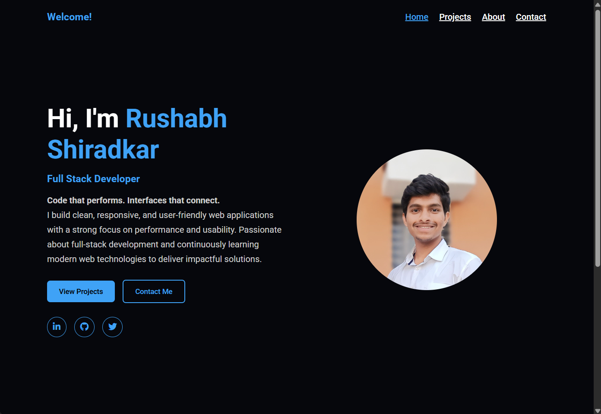

# 🌐 My Portfolio
**Code that performs. Interfaces that connect.**

This is my personal portfolio website showcasing my projects, skills, and contact details.  
The portfolio is designed with a focus on clean UI, responsiveness, smooth animations, and user experience.

---

## Website

https://rushuz.github.io/rushabhPortfolio.github.io/

### Home Page

## 📌 Features

- Clean and modern user interface  
- Fully responsive across devices  
- Smooth scroll and reveal animations  
- Clickable project cards linked to GitHub repositories  
- Contact page with form and map integration  
- Well-structured and readable codebase  

---

## 🛠️ Tech Stack

- HTML5  
- CSS3  
- JavaScript (ES6)  
- Font Awesome  
- Google Fonts  

Built using core web technologies without any frameworks.

---
## 🧩 Website Sections

- Hero section with introduction and tagline  
- Projects section showcasing key works  
- About section with professional summary  
- Contact section with form and map  
- Footer with copyright information  

---

## 📁 Projects Included

- Online Auction Platform (MERN Stack)  
- AI Enabled Real-Time Sales Call Assistant  
- Turf Booking Application (Flutter + Firebase)  

Each project card redirects to its respective GitHub repository.

